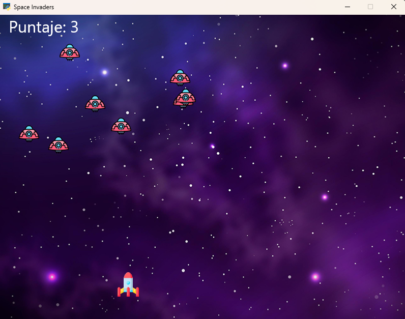

# 🚀 Space Invaders

Remake del clásico arcade Space Invaders desarrollado en Python con arquitectura modular por capas.

---

## 📸 Demo



---

## 🛠️ Tecnologías

| Herramienta | Uso |
|---|---|
| Python 3.12 | Lenguaje principal |
| Arcade 3.x | Motor gráfico y de sprites |
| uv | Gestión de dependencias y entorno virtual |
| pytest | Suite de pruebas unitarias |

---

## 📁 Estructura del proyecto

```
space-invaders/
│
├── assets/
│   ├── images/
│   │   ├── player/
│   │   ├── enemies/
│   │   ├── projectiles/
│   │   └── ui/
│   ├── sounds/
│   └── fonts/
│
├── src/
│   ├── core/          # Lógica del juego (sin dependencia de Arcade)
│   ├── entities/      # Player, Enemy, Bullet — heredan arcade.Sprite
│   ├── managers/      # EnemyManager, BulletManager, AudioManager
│   ├── ui/            # HUD, pantallas — heredan arcade.View
│   └── settings.py    # Constantes y rutas centralizadas
│
├── tests/
├── main.py
├── pyproject.toml
└── uv.lock
```

---

## ⚙️ Instalación y ejecución

### Requisitos previos

- Python 3.12+
- [uv](https://docs.astral.sh/uv/) instalado

### Pasos

```bash
# 1. Clonar el repositorio
git clone https://github.com/tu-usuario/space-invaders.git
cd space-invaders

# 2. Instalar dependencias
uv sync

# 3. Ejecutar el juego
uv run main.py
```

---

## 🧪 Tests

```bash
uv run pytest
uv run pytest --cov=src
```

---

## 🏗️ Decisiones técnicas

### Arquitectura modular por capas

El proyecto está organizado en capas con responsabilidades bien delimitadas:

- **`core/`** — lógica pura del juego, sin acoplamiento a Arcade
- **`entities/`** — objetos del juego como clases que heredan `arcade.Sprite`
- **`managers/`** — coordinan colecciones de entidades usando `arcade.SpriteList`
- **`ui/`** — pantallas y HUD usando `arcade.View`

Esto permite testear la lógica de colisiones y puntaje de forma aislada, sin levantar una ventana gráfica.

### Migración de Pygame a Arcade

Se eligió Arcade sobre Pygame porque su modelo orientado a objetos hace que la separación de responsabilidades emerja de forma natural desde la propia librería, produciendo código más limpio y legible en portafolio.

### uv como gestor de dependencias

Se usa `uv` en lugar de `pip` + `venv` por su velocidad y porque el `uv.lock` garantiza reproducibilidad exacta para cualquier persona que clone el repositorio.

### Rutas con `pathlib`

Todas las rutas a assets se resuelven con `pathlib.Path` desde `settings.py`, eliminando los `os.path.join` dispersos en el código original y garantizando compatibilidad entre sistemas operativos.

---

## 🎮 Controles

| Tecla | Acción |
|---|---|
| `←` `→` | Mover nave |
| `Espacio` | Disparar |

---

## 📚 Proceso de aprendizaje

Este proyecto se desarrolló con Claude (Anthropic) como mentor de arquitectura: presentando opciones de diseño con sus ventajas y desventajas en cada decisión clave, mientras yo elegía el enfoque y transcribía, ejecutaba y depuraba el código manualmente. Los bugs de transcripción y su diagnóstico a partir de los tracebacks fueron parte activa de ese proceso de aprendizaje.

El mayor reto de este refactor fue convertir un script monolítico de Pygame en una arquitectura modular por capas, separando entidades, managers, lógica del juego e interfaz que originalmente convivían en un solo archivo. Adicionalmente, se migró de Pygame a Arcade, adoptando un modelo orientado a objetos donde cada elemento del juego hereda de `arcade.Sprite` y la ventana principal de `arcade.Window`, lo que hizo que la separación de responsabilidades emergiera de forma natural desde la propia librería.

---

## 📄 Licencia

MIT